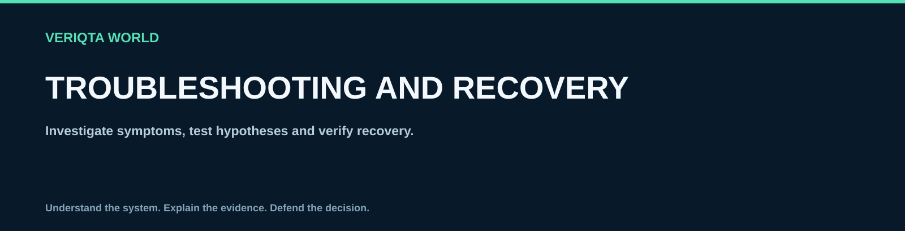

# Troubleshooting and recovery

Investigate symptoms, test hypotheses and verify recovery.

## Explore

- [Linux troubleshooting method](linux-troubleshooting-method.md)
- [Server is unreachable](server-is-unreachable.md)
- [Ssh login is failing](ssh-login-is-failing.md)
- [Service will not start](service-will-not-start.md)
- [Disk space or inodes are exhausted](disk-space-or-inodes-are-exhausted.md)
- [Cpu or memory usage is high](cpu-or-memory-usage-is-high.md)
- [Dns resolution is failing](dns-resolution-is-failing.md)
- [Filesystem is read only](filesystem-is-read-only.md)
- [Server will not boot](server-will-not-boot.md)
- [Verify recovery after a fix](verify-recovery-after-a-fix.md)

[Return to LINUX-WORLD](../README.md)
