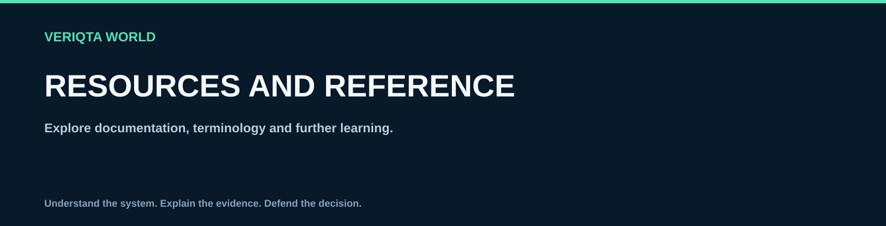

# Resources and reference

Explore documentation, terminology and further learning.

## Explore

- [Linux official documentation](linux-official-documentation.md)
- [Linux books and learning resources](linux-books-and-learning-resources.md)
- [Linux glossary](linux-glossary.md)
- [Linux filesystem reference](linux-filesystem-reference.md)
- [Linux configuration file reference](linux-configuration-file-reference.md)
- [Linux log location reference](linux-log-location-reference.md)
- [Linux networking reference](linux-networking-reference.md)
- [Linux interview preparation](linux-interview-preparation.md)

[Return to LINUX-WORLD](../README.md)
