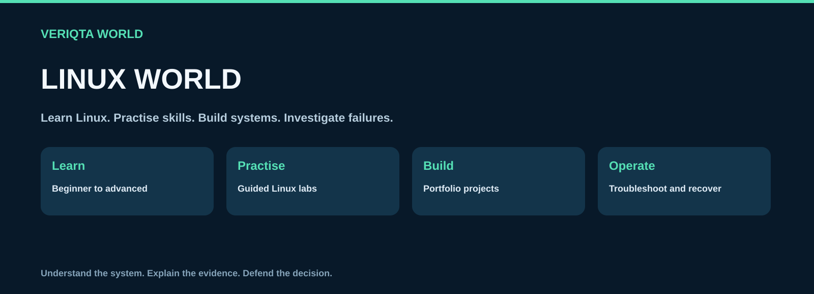
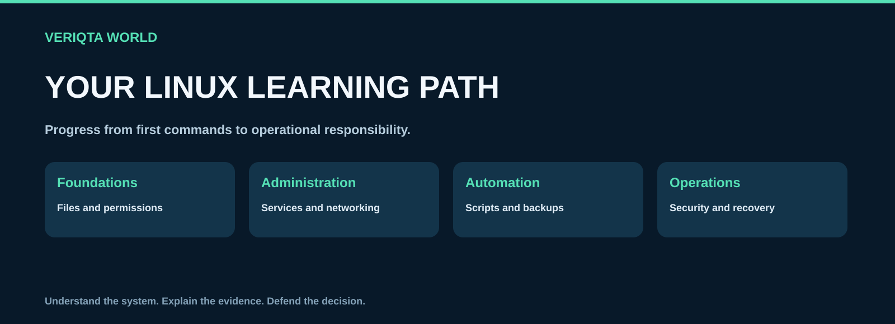
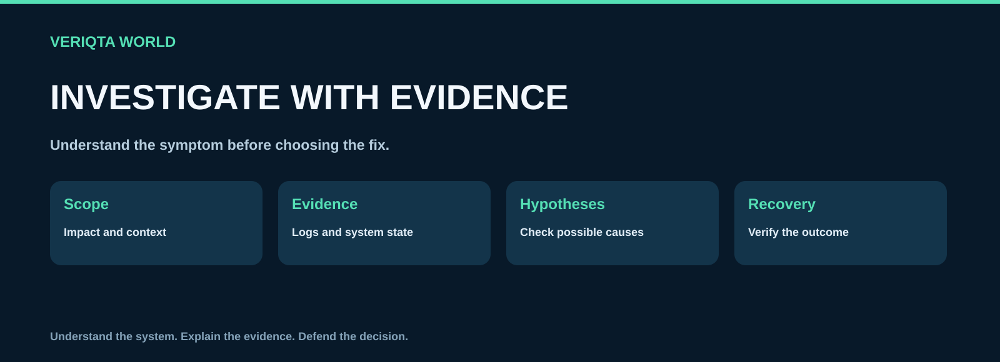

# LINUX-WORLD

**Learn Linux, practise operational skills and build portfolio projects from beginner foundations to advanced administration.**

[Start here](00-start-here) · [Learn Linux](01-beginner-to-advanced) · [Practise labs](02-labs) · [Build projects](03-projects) · [Find commands](04-commands-and-cheat-sheets)

LINUX-WORLD connects clear explanations with hands-on practice, complete project builds, command references and evidence-based troubleshooting. Explore files, permissions, processes, services, networking, storage, scripting, security, performance and recovery in the context of real engineering work.

## Explore Linux World

| Collection | What you can explore |
| --- | --- |
| [Start here](00-start-here) | Set up Linux, choose a learning path and practise safely. |
| [Beginner to advanced](01-beginner-to-advanced) | Build Linux knowledge through a progressive lesson sequence. |
| [Linux labs](02-labs) | Practise individual skills through guided exercises and controlled failures. |
| [Linux portfolio projects](03-projects) | Build complete Linux systems and document your engineering decisions. |
| [Commands and cheat sheets](04-commands-and-cheat-sheets) | Find commands, examples and quick operational references. |
| [Troubleshooting and recovery](05-troubleshooting-and-recovery) | Investigate symptoms, test hypotheses and verify recovery. |
| [Production administration](06-production-administration) | Maintain server access, services, updates, backups and operational health. |
| [Linux distributions](07-linux-distributions) | Understand distribution families and important administration differences. |
| [Resources and reference](08-resources-and-reference) | Explore documentation, terminology and further learning. |

## Follow your learning path

Start with navigation, files and permissions. Develop confidence with processes, services, packages and networking. Progress to storage, scripting, automation, security and operational investigation. Connect each lesson to a lab, then use projects to combine skills into a working system.

| Stage | Learning focus |
| --- | --- |
| Foundations | Files, text, users, permissions and command behaviour |
| Administration | Services, packages, remote access, networking and storage |
| Automation | Shell scripts, scheduled work, archives and backups |
| Advanced operations | Performance, security, recovery and server ownership |

[Explore the lesson sequence](01-beginner-to-advanced)

## Practise individual skills

Labs provide a focused setup, task, verification, troubleshooting and cleanup sequence. Practise in an isolated environment, inspect command results and explain why each action works.

[Browse Linux labs](02-labs)

## Build portfolio projects

Explore junior, mid-level and senior projects. Each follows thirteen steps covering the system goal, environment, implementation, automation, security, deployment, monitoring, failure recovery, independent improvement, portfolio documentation and cleanup.

- [Junior projects](03-projects/01-junior)
- [Mid-level projects](03-projects/02-mid-level)
- [Senior projects](03-projects/03-senior)

Document the architecture, commands, test results and a failure investigation. Describe guided work accurately and explain the independent changes you made. Project completion does not establish professional production experience or guarantee employment.

## Investigate failures with evidence

Define the impact, inspect relevant logs and system state, test competing explanations and verify recovery. Understand the effects of a command before running it, particularly when it changes permissions, storage, networking or service state.

[Find symptom-based troubleshooting](05-troubleshooting-and-recovery)

## Develop operational responsibility

Explore server readiness, access management, patching, service maintenance, log management, backups, monitoring, capacity and retirement. Plan changes and recovery, then confirm the result with evidence.

[Explore production administration](06-production-administration)

## Understand distribution differences

Linux distributions share core concepts while differing in packaging, defaults, configuration and security tooling. Use distribution notes alongside the main lessons and verify examples against your chosen environment.

[Browse distribution notes](07-linux-distributions)

## Find references and prepare for interviews

Use command references for syntax and examples, and authoritative documentation for detailed behaviour. Practise explaining your investigations and project decisions.

[Commands and cheat sheets](04-commands-and-cheat-sheets) · [Resources and reference](08-resources-and-reference) · [DEVOPS-INTERVIEW-WORLD](https://github.com/VERIQTA-WORLD/DEVOPS-INTERVIEW-WORLD)

## Contribute

Improve explanations, practical exercises, command examples and investigation guides. Include applicable distributions, versions, expected results, verification and cleanup.

[Contribution guide](CONTRIBUTING.md) · [Content standard](CONTENT-STANDARD.md)

## About VERIQTA WORLD

VERIQTA WORLD shares engineering resources that connect learning with practical work.

[Explore VERIQTA WORLD](https://github.com/VERIQTA-WORLD)

Names and trademarks belong to their respective owners. This independent educational resource does not imply endorsement or affiliation.
